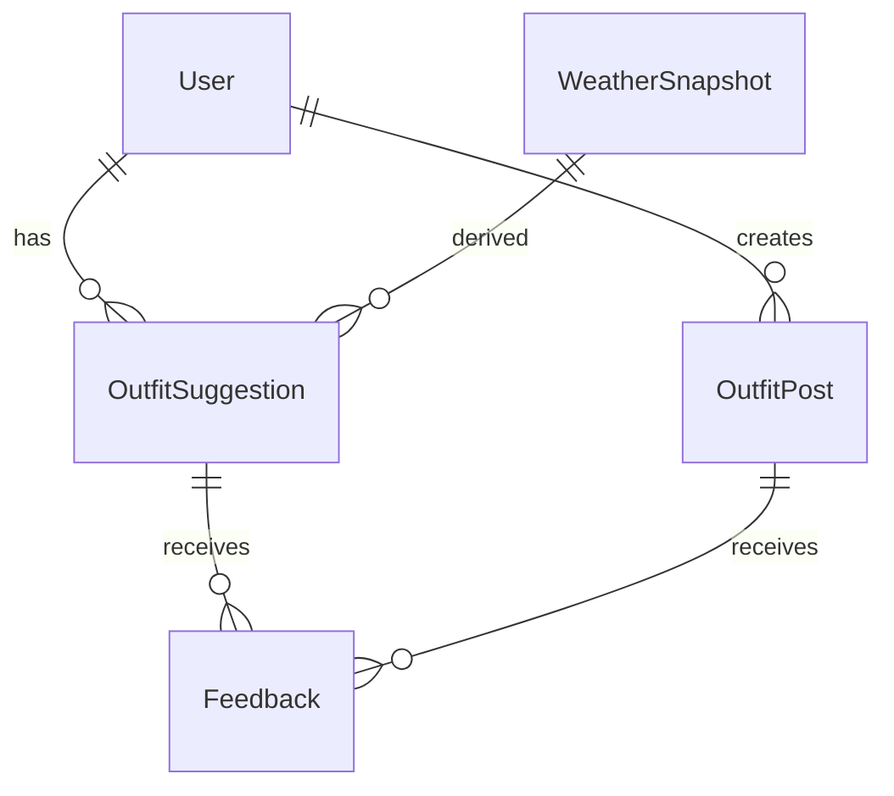

# Wearther システム設計書

## 1. ドキュメント概要
- 目的: 要件定義・アーキテクチャガイドに基づき、Weartherアプリの詳細設計を明らかにする。
- 対象読者: プロダクトマネージャー、iOSエンジニア、Firebase エンジニア、デザイナー、QA。
- 背景: 「天気を“気にする理由”をファッションに変える」若年層向け天気×ファッションアプリ。SwiftUI + Firebase + Weathernews APIを利用。

## 2. 全体アーキテクチャ概要
```
┌───────────────────────────────┐
│           iOSアプリ (SwiftUI, MVVM)           │
│  Views ─ ViewModels ─ UseCases ─ Services   │
│         │             │             │        │
│         │             │             ├── Weather API Client
│         │             │             ├── Firebase Repository
│         │             │             └── Local Cache (AppStorage/CoreData検討) │
└─────────────▲──────────────────────┘
              │ Firestore / Auth / Storage / FCM / Functions
┌─────────────┴──────────────────────┐
│        Firebase バックエンド (GCP)          │
│  Authentication / Firestore / Storage      │
│  Cloud Functions (Weather cron, AI推論)    │
│  Cloud Messaging / Analytics / Crashlytics │
└─────────────▲──────────────────────┘
              │ HTTP(S)
┌─────────────┴──────────────────────┐
│          Weathernews API            │
│  現在/時間別/週間天気エンドポイント     │
└────────────────────────────────────┘
```

- クライアントは主にViewModelからServicesを通じて外部サービスと通信。
- Firebase Cloud FunctionsがWeathernews APIの定期取得・AI推論・通知送信を担う。
- Firestoreが主要データストア。キャッシュデータ・ランキングはFunctionsで集計。

## 3. クライアント構成 (SwiftUI)
### 3.1 レイヤー構成
- **Views**: UI表示。状態はViewModelから`@StateObject`/`@ObservedObject`で受け取る。
- **ViewModels**: 状態管理・ユーザー操作ハンドリング・UseCase呼び出し。
- **UseCases (Interactor層)**: ViewModelから呼ばれ、複数サービスを組み合わせたビジネスロジックを担当。
- **Services / Repository**: 外部API・Firestore・Storageとの通信。`protocol`で抽象化。
- **Utilities**: 共通拡張、フォーマッター、エラーマッピング。

### 3.2 主要画面とViewModel
| 画面 | View | ViewModel | 主な責務 |
| ---- | ---- | --------- | -------- |
| ホーム | `HomeView` | `HomeViewModel` | 天気カード表示、ウィジェット連携、AI提案概要表示 |
| 詳細天気 | `WeatherDetailView` | `WeatherDetailViewModel` | Weathernewsデータ取得、グラフ描画、通知設定管理 |
| AI提案 | `OutfitSuggestionView` | `OutfitSuggestionViewModel` | AI提案表示、フィードバック送信 |
| コーデ投稿一覧 | `FeedView` | `FeedViewModel` | Firestoreクエリ、ランキング/おすすめ切替 |
| 投稿作成 | `PostComposerView` | `PostComposerViewModel` | 画像アップロード、タグ付け、WeatherSnapshot紐づけ |
| プロフィール | `ProfileView` | `ProfileViewModel` | 投稿/保存一覧、フォロー情報 |
| 設定 | `SettingsView` | `SettingsViewModel` | 通知設定、アカウント操作、リンク表示 |

### 3.3 ナビゲーション
- `TabView`で「ホーム」「コミュニティ」「AI提案」「プロフィール」を構成。
- 詳細画面はNavigationStackで遷移。
- `Sheet`で投稿作成画面、`FullScreenCover`で初回セットアップ。

### 3.4 状態管理と非同期
- ViewModelは`@MainActor`、`async/await` + `Task`でデータ取得。
- `ObservableObject`と`@Published`で画面更新。
- 共有状態（ログイン情報、設定、通知フラグ）は`AppState`を`@EnvironmentObject`で提供。
- 背景更新（ウィジェット・バックグラウンドFetch）は`BackgroundTasks`と`AppGroup`経由でシェア。

## 4. バックエンド連携設計
### 4.1 Firestore コレクション設計
- `users/{userId}`: プロフィール、好み、耐性、通知設定。
- `weather_snapshots/{locationCode}` サブコレクション `records/{timestamp}`: Weathernewsから取得したキャッシュ。
- `outfit_suggestions/{userId}/daily/{date}`: AI生成提案とフィードバック履歴。
- `posts/{postId}`: コーデ投稿。`likes`, `saves`サブコレクション。
- `feeds/{feedType}/entries/{postId}`: 人気/おすすめをFunctionsで生成。
- `feedback/{feedbackId}`: 汎用フィードバック保持。Cloud Functionsで集計。

### 4.2 Firebase Authentication
- 初期はメール+パスワード。`SettingsView`でパスワード変更、退会。
- 将来のソーシャルログインに備え`AuthProvider`列挙型を導入。

### 4.3 Storage
- `posts/{userId}/{postId}/{assetId}.jpg` の命名。サムネイル生成用Functionsを準備。
- 画像アップロードは`FirebaseStorageManager`サービスで抽象化。

### 4.4 Cloud Functions
- **`fetchWeatherCron`**: 30分間隔でWeathernews APIをポーリングし`weather_snapshots`更新。
- **`generateDailySuggestions`**: 毎朝6時に対象ユーザーへAI提案生成。WeatherSnapshot + ユーザープロファイルを参照。
- **`sendAlerts`**: 通知条件（雨/気温変化）を評価しFCM送信。
- **`updateTrendingFeeds`**: 投稿のいいね数を集計しランキングコレクション更新。
- **`onFeedbackWrite`**: フィードバックを解析しAIモデル学習用キューに登録。

### 4.5 Weathernews API クライアント
- `WeatherAPIClient`がHTTPリクエストを管理。
- `WeatherEndpoint`列挙でURL・パラメータ管理。
- エラーハンドリング: API制限やレスポンス異常時に`WeatherError`へマッピング。
- レスポンスキャッシュ: URLSessionCache + Firestoreキャッシュを併用。

## 5. ユースケース詳細
### 5.1 ホーム表示
1. `HomeView`表示時、`HomeViewModel`が`loadCurrentSnapshot()`を実行。
2. UseCaseが`WeatherRepository`から最新`WeatherSnapshot`を取得（Firestoreキャッシュ優先、なければAPI）。
3. 同時に`SuggestionRepository`から当日提案を取得。未生成の場合Functionsを呼び出す。
4. 結果を組み合わせて`HomeViewState`を更新。

### 5.2 AI提案フィードバック
1. ユーザーが評価を送信 → `OutfitSuggestionViewModel`が`submitFeedback()`を呼び出し。
2. Firestoreに`Feedback`ドキュメント作成。
3. Functions `onFeedbackWrite`がトリガーされ、学習用バッチに登録。
4. 次回`generateDailySuggestions`実行時にフィードバックを反映（好みスコア更新、提案補正）。

### 5.3 コーデ投稿フロー
1. 投稿作成で写真選択 → `PostComposerViewModel`がローカルプレビュー生成。
2. 「投稿」タップで`createPost()`実行。
   - Storageへ画像アップロード。
   - WeatherSnapshotを`WeatherRepository`で取得、「雨」などの天気タグ自動生成。
   - Firestoreの`posts`コレクションにドキュメント作成。
3. Functions `updateTrendingFeeds`が定期的にランキング更新。
4. `FeedViewModel`が`FeedRepository`経由でタイムライン/おすすめデータを取得。

## 6. データフロー
### 6.1 主要データ構造 (抜粋)


### 6.2 Firestore ドキュメント例
```json
// users/{userId}
{
  "displayName": "Haruka",
  "photoURL": "https://...",
  "gender": "female",
  "region": "tokyo",
  "stylePreferences": ["casual", "street"],
  "temperatureTolerance": "cool",
  "notificationSettings": {
    "rainAlert": true,
    "tempDropAlert": true,
    "dailySuggestionTime": "07:00"
  }
}
```

## 7. APIインタラクション仕様
| UseCase | エンドポイント | メソッド | 備考 |
| ------- | -------------- | -------- | ---- |
| 現在の天気 | `/v1/current` | GET | locationCode必須、キャッシュ1h |
| 1時間予報 | `/v1/hourly` | GET | 24時間分取得、グラフ描画に利用 |
| 週間予報 | `/v1/weekly` | GET | 詳細画面の週間タブ |
| Notification判定 | Functions | Scheduled | Weathernews APIをFunctionsから呼出 |
| AI提案生成 | Functions | Scheduled/API | on-demand API + cron |

- APIキーは`SecretsManager`(Functions)と`XCConfig`に分離。アプリ内埋め込みは避け、Functions経由で署名付きリクエストを発行する案も検討。

## 8. AI提案ワークフロー
1. Cloud Functionsが対象ユーザーの最新WeatherSnapshot・プロフィール・投稿履歴を取得。
2. LLM API (例: Vertex AI, OpenAI)にプロンプト送信。
3. 応答テキストを`OutfitSuggestion`としてFirestoreに保存。
4. クライアントは`SuggestionRepository`で当日提案を購読し表示。
5. フィードバックは`Feedback`文書に記録、バッチ処理でベクトル化（将来の類似ユーザー推薦に利用）。

- 初期はLLMコスト最適化のため、結果キャッシュ + テンプレート補正を活用。
- 不適切表現フィルタ: Functionsで安全フィルタリング。

## 9. 通知設計
- Firebase Cloud Messagingを使用。
- 通知タイプごとにTopic/トークン管理。
  - `weather_alert_{region}`: 雨・気温変化など地域別通知。
  - `daily_suggestion_{userId}`: 個別提案。
  - `social_{userId}`: いいね/コメント通知。
- iOSクライアントは通知受信時に`NotificationCenter`へイベント送信し、表示中画面を更新。
- 通知設定変更は`SettingsView`からFirestoreとFCMトークン設定を更新。

## 10. ウィジェット & 拡張
- WidgetKitによるシングルサイズ（中）ウィジェット。
- App Group経由で`WeatherSnapshot`キャッシュを共有。
- タイムライン更新: `TimelineProvider`がFunctionsから取得したキャッシュを使用し1時間ごと更新。
- 将来的なApple Watch拡張: WatchConnectivityでデータ同期。

## 11. エラーハンドリング & ロギング
- クライアント: `ResultState`列挙 (`idle`, `loading`, `success`, `failure`) をViewModelで管理。
- ネットワーク失敗時はスナックバー表示とリトライボタン。
- 重大エラーはCrashlyticsへ送信。
- Functions: Cloud Logging + Error Reporting。リトライ制御、サーキットブレイカーを導入。

## 12. セキュリティ/プライバシー
- Firestore Security Rules
  - `users/{userId}`: 本人のみ読み書き可。
  - `posts`: 公開読み取り、本人/管理者のみ編集。
  - `feedback`: 本人書き込み、Functionsで読み取り。
- Storage Rules: 投稿画像は公開読み取り (URLパターン制御)、書き込みは本人のみ。
- APIキー保護: WeathernewsキーはFunctions内でのみ使用。
- プライバシー: 位置情報は地域単位に丸めて保存、個別座標は保持しない。

## 13. パフォーマンス・キャッシュ戦略
- `WeatherRepository`はFirestoreキャッシュ + URLSessionキャッシュ併用。
- Firestoreクエリ最適化: タイムラインは`createdAt`にインデックス。ランキングはFunctionsで事前集計。
- 画像: Storageにアップロード後、サムネイル生成してApp内でLazy Loading。

## 14. テスト戦略
- 単体テスト: ViewModel、UseCaseに対しMockサービスでテスト。
- UIテスト: 主要フロー（ホーム、詳細、投稿、通知設定）。SnapshotテストでUI変化検知。
- Integrationテスト: Functionsのスケジュールジョブはエミュレータ + staging環境で検証。
- Monitoring: Crashlytics, Analyticsでイベント計測。A/BテストはRemote Configで実施予定。

## 15. リリース・運用考慮
- 環境分離: `dev`, `staging`, `prod`のFirebaseプロジェクト。`GoogleService-Info.plist`をターゲット毎に設定。
- Feature Flag: Remote Configで段階的公開（AI提案、投稿共有機能）。
- メトリクス監視: MAU、通知開封率、投稿率をAnalyticsで計測しダッシュボード化。

## 16. 残課題 & 検討事項
- AI推論基盤の具体的なLLM選定とコスト試算。
- 投稿モデレーションの自動化（Vision APIなど）導入時期。
- Apple Watch対応の優先度と実施時期。
- ショッピング連携（ECリンク・アフィリエイト）の導入判断。
- AR Try-onやバーチャルクローゼット機能の技術調査。
- 多言語対応のUI/ローカライゼーション方針。

